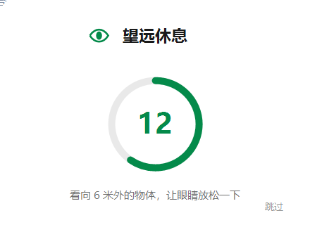
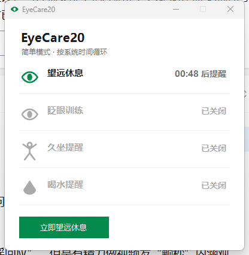

# EyeCare20 · 护眼提醒小工具

> 每用眼 20 分钟，望远 20 秒 —— 一个 **68KB**、零依赖、绿色单文件的 Windows 桌面护眼助手

[]()
[]()
[]()
[]()

**[English intro](#english)** **·** **[下载安装](#-下载安装)** **·** **[专题页](https://gitee.com/songyun/EyeCare20)**

***

## 为什么是 EyeCare20

长时间盯屏幕带来的眼干、眼疲劳、久坐和缺水，靠意志力提醒自己没用——让软件替你记得。
基于医学推荐的 **20-20-20 法则**（每 20 分钟，看 20 英尺≈6 米外，持续 20 秒）与眨眼训练设计。

它有多小？**一个 68KB 的 exe**（不到同类 Electron 方案的 1/4000），不做任何事时仅占用约 35MB 内存，
不联网、不上传、无任何依赖——Windows 10/11 预装运行时，下载即用。

| <br />    | EyeCare20    | Stretchly    | Project Eye |
| --------- | ------------ | ------------ | ----------- |
| 体积        | **68 KB**    | \~300 MB     | \~20 MB     |
| 内存占用      | \~35 MB      | \~200 MB+    | \~80 MB     |
| 依赖        | 无            | Electron 运行时 | .NET        |
| 提醒合并/错峰   | **有**        | 无            | 无           |
| 休息中操作自动暂停 | **有**        | 无            | 无           |
| 国内更新源     | **Gitee 直连** | -            | -           |

## 功能特性

- **四类健康提醒统一管理**：望远休息（20-20-20）、眨眼训练（闭眼 2 秒 + 完整眨眼 5 次）、久坐提醒、喝水提醒——每类可独立开关/设间隔

- **智能合并与错峰**：到期时间相差 5 分钟内的提醒自动合并为一张卡片同时弹出；重排后任意两个提醒至少相差 5 分钟，永不打扰流

- **休息中智能暂停**：休息倒计时期间检测到键鼠操作或全屏应用（游戏/电影）→ 倒计时自动冻结，真正停下来才继续；看视频/听歌不受影响

- **双模式计时**：简单模式按系统时间循环；高级模式仅在操作电脑（键鼠/音频输出）时累计时长

- **数据统计**：按日记录完成/跳过/休息时长，今日摘要 + 最近 7 天柱状图

- **全自动更新**：内置 Gitee/GitHub 双源回退（国内 Gitee 优先，国外 GitHub 回退），一键完成下载→替换→重启

- **清爽界面**：屏幕居中提醒卡、环形倒计时、矢量自绘图标（零图片资源）、主色 `#048A4A` 极简风格

- **细节体验**：开机自启（免管理员）、全屏免打扰、锁屏不停歇、单实例、不抢键盘焦点

## 截图

|                  望远休息提醒卡                  |             主界面（剩余时间）             |
| :---------------------------------------: | :-------------------------------: |
|  |  |

## 📥 下载安装

1. 从任一平台下载 `EyeCare20.exe`（单文件，无需安装）：

   - **国内用户（Gitee）**：[Releases 下载](https://gitee.com/songyun/EyeCare20/releases)

   - **国际用户（GitHub）**：[Releases 下载](https://github.com/chenbf0713/EyeCare20/releases)
2. 双击运行即可（首次运行若被 SmartScreen 提示：右键 exe → 属性 → 勾选"解除锁定"）
3. 托盘右键 → **开机自启动**，一劳永逸

> 配置与统计数据保存在 `%APPDATA%\EyeCare20\`，升级或换机不会丢失。

## 使用说明

- **双击托盘图标**：打开主界面，实时查看各提醒的剩余倒计时

- **右键托盘图标**：主界面 / 设置 / 统计 / 检查更新 / 立即望远休息 / 暂停 1 小时 / 退出

- **设置页**：切换计时模式、调整四类提醒的间隔与开关、提醒声音、自启动

- **更新**：启动时自动静默检查；发现新版本弹窗，点"立即更新"即自动完成（下载→替换→重启约 2 秒）

## 更新源说明（重要）

软件内置双更新源，开箱即用：

| 优先级 | 平台           | update.json 地址                                                            |
| --- | ------------ | ------------------------------------------------------------------------- |
| 1   | Gitee（国内快）   | `https://gitee.com/songyun/EyeCare20/raw/main/update.json`                |
| 2   | GitHub（国际回退） | `https://raw.githubusercontent.com/chenbf0713/EyeCare20/main/update.json` |

自建更新源：在 `%APPDATA%\EyeCare20\config.json` 的 `UpdateUrl` 填写地址即可覆盖（多个地址用 `|` 分隔，按序回退）。
`update.json` 格式：

```json
{
  "version": "1.3.1.0",
  "downloadUrl": "https://gitee.com/songyun/EyeCare20/releases/download/v1.3.1/EyeCare20.exe",
  "downloadUrlAlt": "https://github.com/chenbf0713/EyeCare20/releases/download/v1.3.1/EyeCare20.exe",
  "notes": "更新说明"
}
```

`downloadUrl`（主，建议 Gitee Releases）失败时自动尝试 `downloadUrlAlt`（备用，建议 GitHub Releases）。

## 从源码构建

```bash
git clone https://gitee.com/songyun/EyeCare20.git   # 或 github
cd EyeCare20
dotnet build -c Release
# 产物：bin/Release/net48/EyeCare20.exe
```

无 SDK 环境兜底（Windows 自带编译器，仅支持 C# 5 语法，本项目已按此约束编写）：

```bash
C:\Windows\Microsoft.NET\Framework64\v4.0.30319\csc.exe /target:winexe /out:EyeCare20.exe ^
  /r:System.Windows.Forms.dll /r:System.Drawing.dll /r:System.Runtime.Serialization.dll ^
  /r:System.IO.Compression.dll /r:System.IO.Compression.FileSystem.dll *.cs
```

## 项目结构

```
EyeCare20/
├── Program.cs            入口：单实例互斥锁
├── TrayContext.cs        托盘常驻：菜单/卡片分发/更新检查
├── Scheduler.cs          调度器：双模式计时 + 合并 + 错峰
├── ActivityMonitor.cs    键鼠/音频活动检测（GetLastInputInfo + Core Audio）
├── CardForm.cs           提醒卡基类：居中/淡入淡出/不抢焦点/倒计时暂停
├── ReminderForm.cs       通用倒计时卡（单/多事项合并）+ 矢量图标
├── BlinkForm.cs          眨眼训练动画卡
├── MainForm.cs           主界面（剩余时间）
├── SettingsForm.cs       设置页
├── StatsForm.cs          统计页（7 天柱状图）
├── StatsStore.cs         按日统计持久化
├── UpdateChecker.cs      多源更新检查
├── UpdateInstaller.cs    自动更新：下载/解包/替换脚本/回滚
├── UpdateProgressForm.cs 更新进度窗
├── UpdateSources.cs      内置双源配置（发布前改 Owner）
├── FullScreenDetector.cs 全屏检测
├── ConfigStore.cs        配置持久化
├── Log.cs                文件日志
└── docs/index.html       专题页（可托管 Gitee/GitHub Pages）
```

## 科学依据

- [20-20-20 法则](https://lookaway.com/20-20-20-rule/)：美国眼科学会/美国验光协会推荐的数字眼疲劳缓解方式，Aston 大学 2022 年研究首次严格验证其有效性（[研究摘要](https://pubmed.ncbi.nlm.nih.gov/35963776/)）

- 眨眼训练：屏幕专注时眨眼频率从每分钟 15–20 次降至 5–7 次，刻意完整眨眼是国际干眼管理报告（TFOS DEWS II/III）推荐的标准行为疗法

- 久坐与定时补水：世卫组织等机构建议的日常健康习惯

## English

**EyeCare20** is a 68KB, zero-dependency Windows tray app for the 20-20-20 eye-care rule, plus blink training, sitting and hydration reminders — with smart merge/spacing between reminders, countdown auto-pause on input or fullscreen apps, daily stats, and fully automatic dual-source (Gitee/GitHub) self-updating. Built with plain C# WinForms (.NET Framework 4.8 preinstalled on Windows 10/11). [Download from Releases](https://github.com/chenbf0713/EyeCare20/releases) · 中文说明见上文。

## Pro 版说明

核心提醒功能**永久免费**。Pro（¥12.9 买断，一次性激活码，离线校验）解锁进阶能力：

- 📊 年度用眼健康报告（可分享）

- 🍅 番茄工作法模式（专注 25 分 + 休息 5 分）

- 📤 周/月报导出

购买渠道：Microsoft Store 搜 "EyeCare20"，或爱发电赞助后私信领取激活码。
激活方式：设置 → Pro → 输入激活码。免费版无任何功能墙、无提醒次数限制。

## 请作者喝杯咖啡

EyeCare20 会永久免费开源。如果它帮到了你，欢迎请作者喝杯咖啡 ☕：

- **爱发电**：[afdian.com/your-id](https://afdian.com/your-id)（推荐，支持一次性与月度）

- **微信 / 支付宝**：收款码见下方（放入 `donate/` 目录后自动显示）

|              微信             |              支付宝             |
| :-------------------------: | :--------------------------: |
|  |  |

> 图片暂未放置时，上面的占位图不影响阅读——也欢迎 Star 代替咖啡 ✨

## 许可证

[MIT](LICENSE) — 自由使用、修改、分发。

> 提示：这是健康辅助工具，不能替代医疗建议。持续眼不适请就医。

